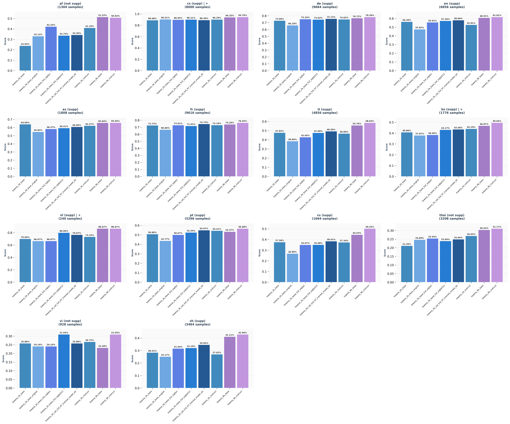
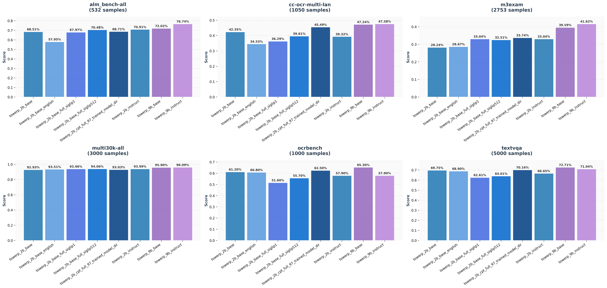

# TowerVision Benchmark Results

This repository contains evaluation results of multiple **TowerVision models** across different benchmarks.  
Each benchmark folder contains per-model results.

---

## 🔤 Nomenclature & Conventions

We follow a structured naming convention for models and results:

### 🧩 Model Naming
- **`base`** → TowerPlus base model  
- **`instruct`** → TowerPlus instruct model  
- **`full`** → trained with **all available data**, including cultural-ground extensions  
- **`siglip1`** → model uses **SigLIP1** as the vision encoder  
- **`siglip2-512`** → model uses **SigLIP2** with higher-resolution input (512)  
- **(no encoder specified)** → by default, the model uses **SigLIP2**  

Examples:
- `towerp_2b_base` → Base model  
- `towerp_2b_instruct` → Instruct model  
- `towerp_2b_base_full_siglip1` → Base model, trained on full data, with SigLIP1 encoder  
- `towerp_2b_base_full_siglip512` → Base model, full data, with SigLIP2 (512 resolution)  

exception:
- `towerp_2b_cpt_full_97` → Base model, full data, siglip2 but trained until 97% (cluster id down temporarily)

---

### 📈 Results Interpretation
- Benchmarks include the **number of samples per benchmark** and **per language**.  
- **`sub`** in a language result → language is supported by TowerVision  
- **`not support`** → language is not supported by TowerVision  
- **`+` (plus sign)** next to a language → additional data for that language was included in **full mode**  

---

## 📊 Benchmarks

- **alm_bench-all**  
- **cc-ocr-multi-lan**  
- **m3exam**  
- **multi30k-all**  
- **ocrbench**  
- **textvqa**

---

## 🧠 Models Evaluated
Examples of models tested:
- `towerp_2b_base`
- `towerp_2b_instruct`
- `towerp_9b_base`
- `towerp_9b_instruct`
- `towerp_2b_base_full_siglip1`
- `towerp_2b_base_full_siglip512 + siglip2_512`
- and more...

---

## 🌍 Results by Language

---

## 🏆 Results by Benchmark

